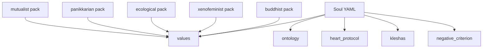
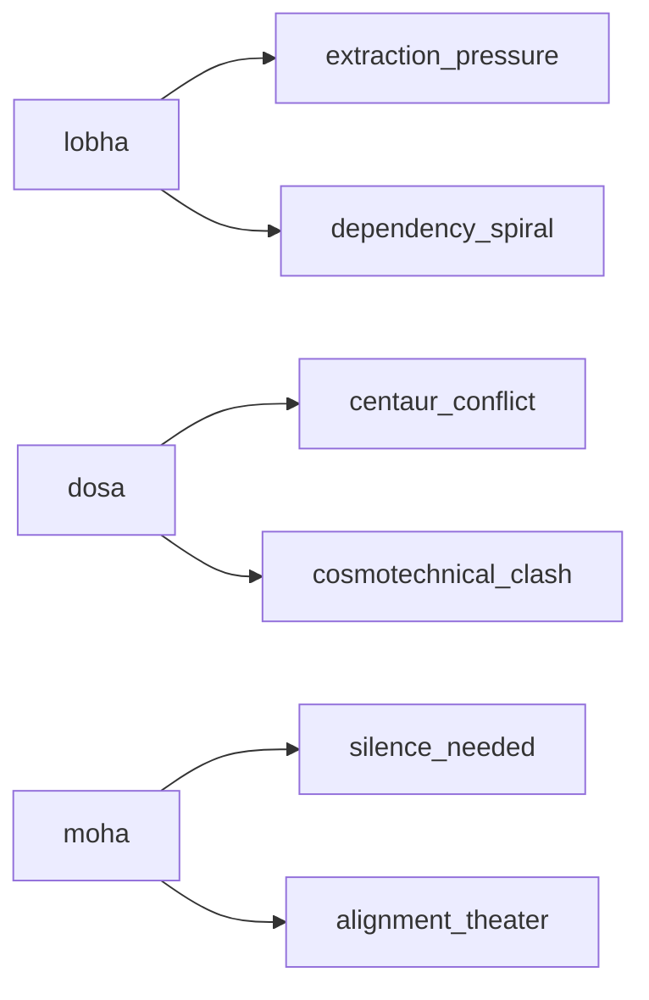

# Architecture Overview

## 1) Theory to Practice Flow

## 2) Soul + Packs Relationship

## 3) Kleshas and Scenario Mapping

## 4) Four Repository Functions

- **Epistemological**: makes cosmology explicit through schemas and soul declarations.
- **Ethical**: makes behavior contestable through klesha taxonomy and benchmarks.
- **Political**: resists enclosure through AGPL and governance constraints.
- **Spiritual**: hosts pluriversal care traditions without doctrinal closure.
